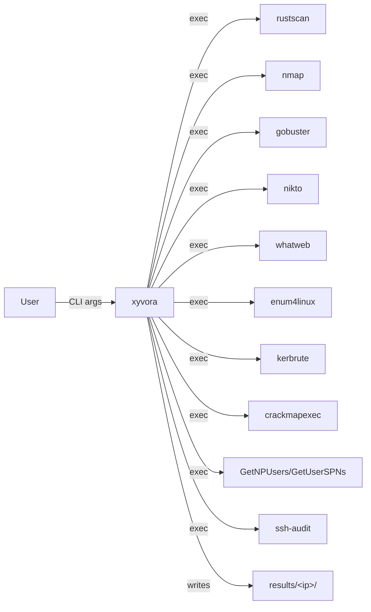

# xyvora Architecture

## System Context



## Core Modules

| Module | Responsibility | External Dependencies |
|--------|---------------|----------------------|
| `main.py` | Orchestration, progress display, CLI wiring | rich |
| `scanner.py` | Port discovery via rustscan, service detection via nmap, XML parsing | rustscan, nmap |
| `modules/http.py` | Web enumeration: directory brute-force, vulnerability scan, fingerprinting | gobuster, nikto, whatweb |
| `modules/smb.py` | SMB share enumeration and user listing | enum4linux, smbclient |
| `modules/ftp.py` | FTP anonymous login detection | ftplib (stdlib) |
| `modules/ssh.py` | SSH configuration audit | ssh-audit |
| `modules/ad.py` | Active Directory enumeration including Kerberos attacks | ldapsearch, kerbrute, impacket, crackmapexec, rpcclient |
| `reporter.py` | Markdown report aggregation | none (stdlib) |
| `utils.py` | Shared subprocess runner, Result type, output helpers | none (stdlib) |

## Data Flow

```
User Input (IP, credentials, domain, --dry-run)
  │
  ▼
Phase 1: rustscan (all ports 0-65535)
  │ → open port list
  ▼
Phase 2: nmap -sC -sV (open ports only)
  │ → nmap.xml + service classification {http: [80,443], smb: [445], ...}
  ▼
Phase 3: Concurrent enumeration
  │  ┌─ HTTP threads  ─ gobuster × N, nikto × N, whatweb × N
  │  ├─ SMB threads   ─ enum4linux, smbclient
  │  ├─ FTP threads   ─ anonymous check × N
  │  ├─ SSH threads   ─ ssh-audit × N
  │  └─ AD threads    ─ domain extraction → ldapsearch, kerbrute, GetNPUsers, etc.
  │     └─ (if creds) ─ ldapsearch auth, GetUserSPNs
  │ → Result objects (stdout, stderr, elapsed, success)
  ▼
Phase 4: Report generation
  │ → results/<ip>/report.md (only non-empty modules included)
```

## Key Design Decisions

### ADR-001: Single-file entry point with internal package
**Decision:** `xyvora.py` at root imports from `src/xyvora/` package.
**Why not:** Single monolithic file → too large; full package with console_scripts → harder to invoke during pentest.

### ADR-002: ThreadPoolExecutor over asyncio
**Decision:** All concurrent execution uses threads, not async.
**Why not:** asyncio is better for I/O but external tools are subprocesses — threads are simpler for subprocess coordination and provide the same parallelism benefit.

### ADR-003: Result dataclass as module contract
**Decision:** All modules return `list[Result]` where `Result` has `.stdout`, `.stderr`, `.success`, `.has_output`.
**Why not:** Dictionary returns lose type safety; generators complicate the progress callback pattern.

### ADR-004: Empty results → no file
**Decision:** `save_result()` checks `result.has_output` and returns `None` for empty results.
**Why not:** Always creating files clutters the output directory and misleads the user about what ran successfully.

## Known Limitations

- No proxy support for tools that require it (nmap, gobuster can be configured externally).
- Single-target only — no CIDR range or hostname list support.
- Depends on tools being in `$PATH` — no auto-install or version checking.
- No rate limiting on concurrent threads — could overwhelm a fragile target.
